# Recruit -THM CTF Challenge Walkthrough

## Infiltrate Recruit's new portal. Map the site, hunt for flaws, and gain unauthorised access


## TASK

**Recruit** has just launched its new recruitment portal, allowing HR staff to manage candidate applications and administrators to oversee hiring decisions. While the platform appears functional, management suspects that security may have been overlooked during development. Your task is to assess the application like a real attacker, mapping its structure, abusing exposed functionality, and exploiting vulnerabilities.

Can you gain an initial foothold, escalate your access, and ultimately log in as the **administrator?**

Let’s start our room by nmap scan and identify the hosts & open ports.

```jsx
sudo nmap -sS -p- <IP_Address>

# -sS is an stealthy-scan [SYN-scan] identifies open ports without completing the full TCP handshake, preventing the target system from logging the connection. 
# -p- scans all 65,535 ports.
```

We obtained the 3 open ports:

1. 22/tcp   ssh
2. 53/tcp  domain 
3. 80/tcp http

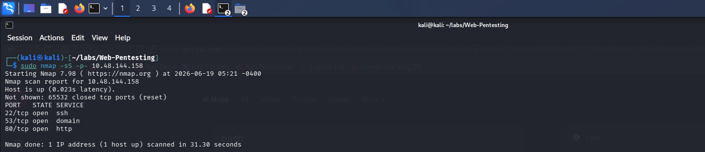

Now let’s try to access the system using the SSH server.

```jsx
sudo ssh -p 22 usr_name@IP 
```

Here I took username as admin, we can try with different names as well,  see there is an requirements of password.
I just passed the default credentials but its not working. 

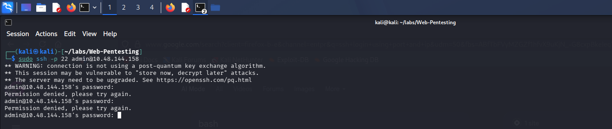

Next, the Port 80 let’s view the page..

We can see that we have a login page, however I tried several commands to test for sql injection and also using default credentials as **admin: admin**, **admin: password, etc..** but nothing worked..

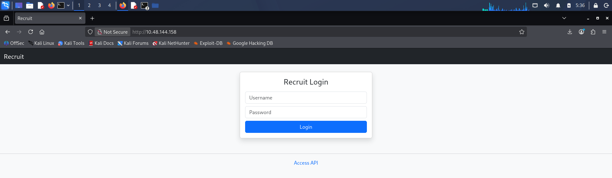

So, let’s run the nikto or gobuster for directories Enumeration. In my case I used nikto scan for enumeration. 

```jsx
sudo nikto -h http://<IP>
```

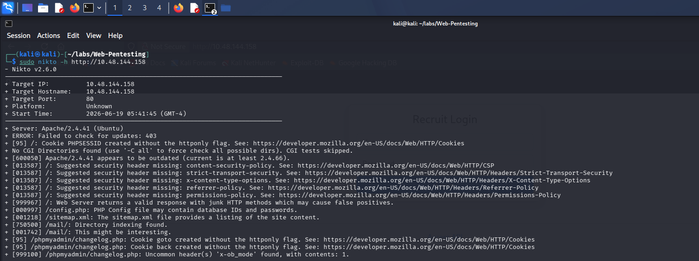

Yep, we would able to see we found few interesting directories and server version..

- Server: Apache/2.4.41 (Ubuntu)

Directories like:

1. /mail 
2. /config.php
3. sitemap.xml

Now let us look into sitemap.xml is a file that lists a website's essential pages. It may contain other pages that are not listed in directory scanning..

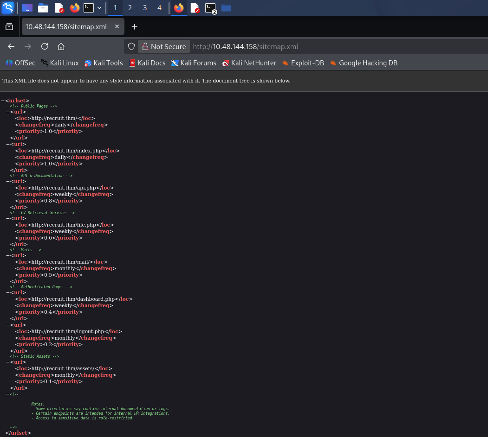

Cool we found few interesting directories like mail and assets and the php pages..

let's look into mail folder.. 

we can see there an another page called mail.log.

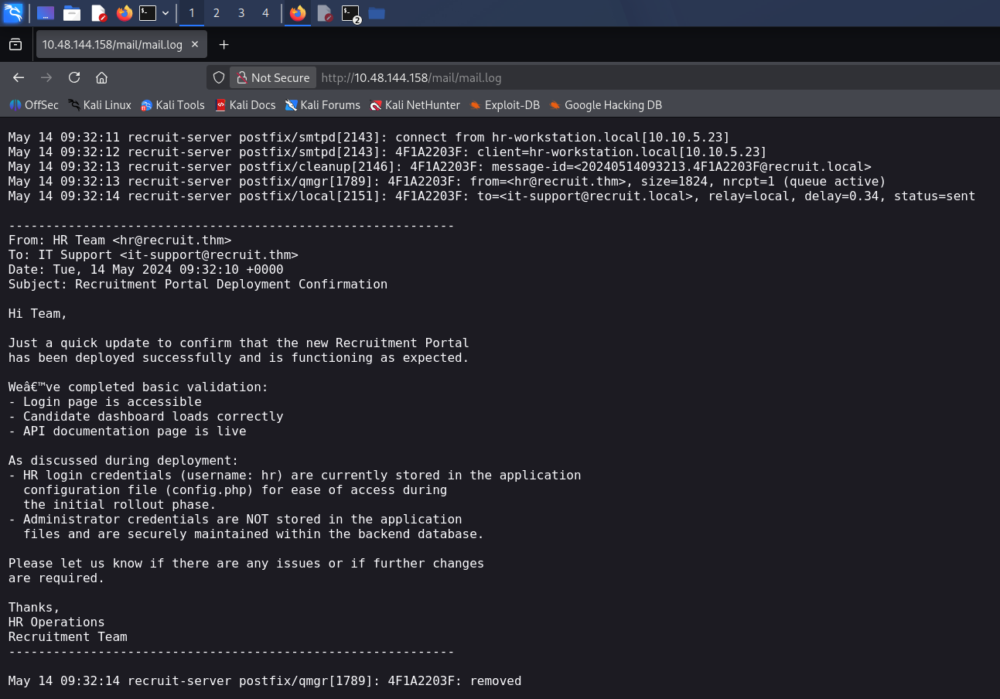

I think we have got the login credential of HR like Username: hr but the password is stored in the config.php file. 

let's try to view the config,php. 

We are not able to fetch the config.php. let look into another php files that are listed in sitemap.xml, the interesting one is api.php lets look into it.

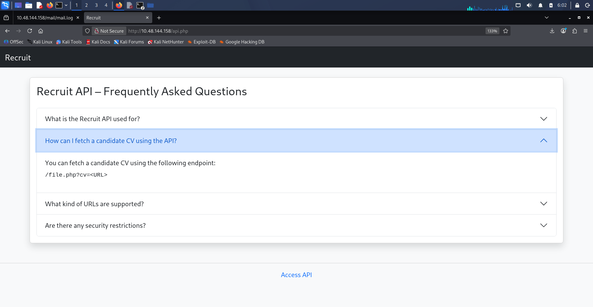

The api.php contains the FAQ’s, the 2nd FAQ reveals the endpoint for cv is `/file.php?cv=<url>`

let's try to use that endpoint to access the config.php 

```jsx
http://<IP>/file.php?cv=config.php
```

Hey it's bit more interesting say only local file are allowed.

It means the developers have added the security filter to avoid RFI [Remote File Inclusion]. To stop RFI, the developer likely wrote a filter that blocks or complains if the input looks like a standard web request, but they accidentally left the door wide open for **Local File Inclusion (LFI)**.

So we can use the PHP Wrappers to access the config.php file. 

```jsx
http://<IP>/file.php?cv=file:///var/www/html/config.php

# file:// [Local File System] -> it tells the server's backend, "Do not go to the internet; fetch this file directly from your own local file system."
# /var/www/html default root directory for web servers (like Apache or Nginx) on Linux systems.
```

Aahaa we got the access to the config.php file, and we found the password to the HR. 

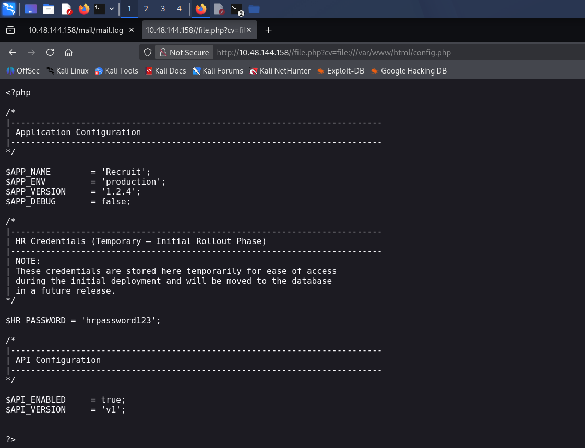

It’s a milestone and we got the user access finally. lets login as HR.

And the flag too..

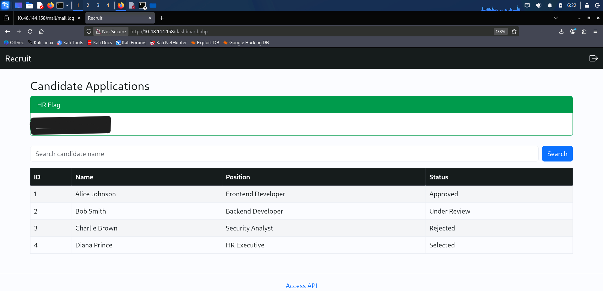

We just accomplished the task1 user login. Now let’s find the Admin Credentials. 

We can see there is an search box lets try with SQL Injection.

```jsx
In search Box add this ' OR 1=1-- 
```

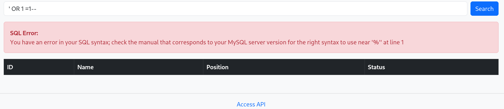

We can see the Data base revels that it is using MySql server. Cool its vulnerable to SQLI.

The error show’s that need to use % at the end. Don't panic simple, as it is an mysql server it can pass the SQL commands only when the there is an space or + or # added in the end. 

```jsx
Like, 'OR 1=1-- , 'OR 1=1--+ , 'OR 1=1--# 
```

In our case just we can add space in the end of comment..

we can see no error it is normally showing the 4 Colum's of candidates. Here is an imp thing that we need to notice is there are 4 columns in the database..
we can confirm it by ORDER BY injection. 

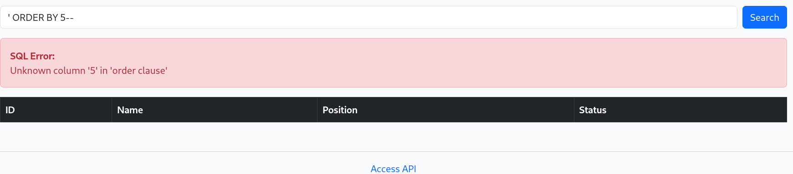

By incrementing the `ORDER BY` clause, we trigger an error at `ORDER BY 5`. This enumerates the number of columns returned by the active `SELECT` statement, confirming there are exactly 4 columns we can interact with."

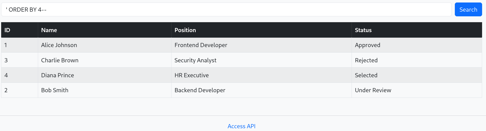

Now let us try to output the version of Mysql using the UNION SELECT.

```jsx
' UNION SELECT version(),NULL,NULL,NULL-- 
```

The DB version is 8.0.33-Oubuntu0.20.04.2

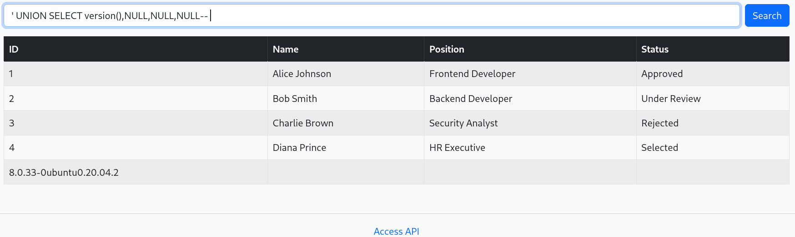

Now let try to retrive the columns present in this DB..

```jsx
'UNION SELECT table_name.NULL,NULL,NULL FROM information_schema.tables-- 
```

We can multiple tables almost 60+ tables.

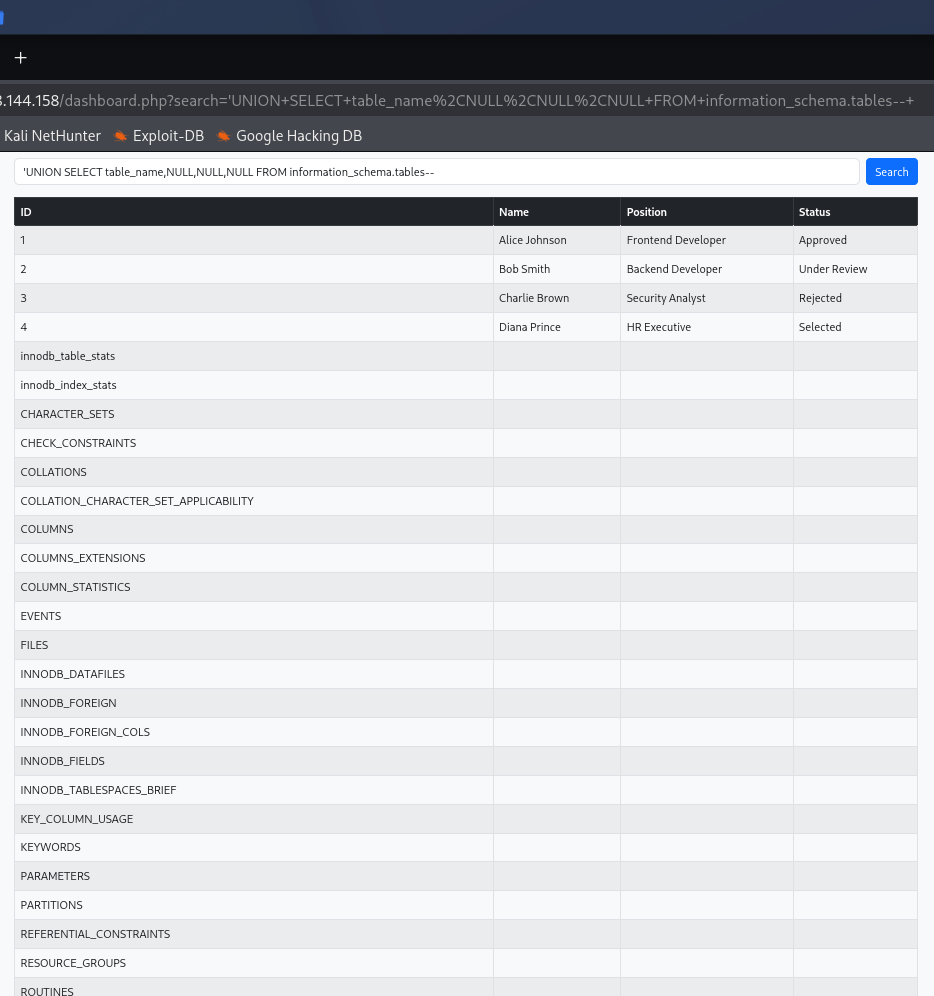

But from all of them there are only few interesting tables that may reveal the usernames and passwords like

- users
- accounts
- hosts
- user

Let enumerate all the tables one by one by using the UNION SELECT clause..

```jsx
'UNION SELECT column_name.NULL,NULL,NULL FROM information_schema.columns WHERE table_name= 'hosts'--

# try to modify the table name using the differnt tables what are intresting.. 
```

And I can see that in only users contains the username and passwords column's. 

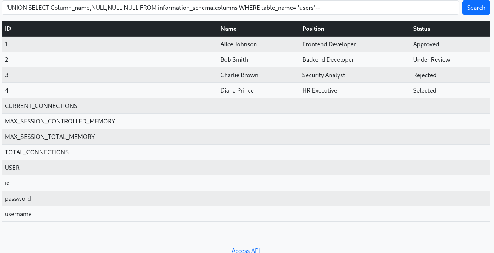

Now enumerate the columns to get the admin credentials. 

```jsx
'UNION SELECT username,password,NULL,NULL FROM users-- 
```

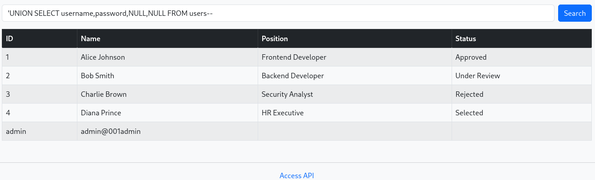

And here we go we got our administrator credentials to use them to log in

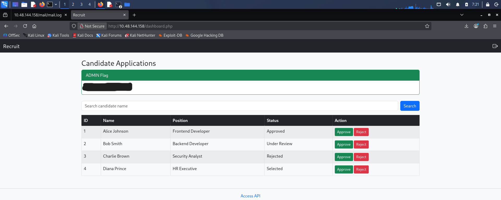

And that’s it we got our administrator flag.. 

# Remediations: Fix the Vulnerabilities.

### 1. Local File Inclusion (LFI)

- **The Flaw:** The `cv` parameter in `file.php` failed to properly sanitize user input, allowing the use of the `file://` wrapper to access local server files. The filter designed to block RFI was insufficient.
- **The Fix:** Never pass user-supplied input directly to filesystem APIs. The best approach is to use **Indirect Object References**. Instead of passing a file path (e.g., `?cv=config.php`), pass an ID (e.g., `?cv=1`) that the backend maps to the correct file safely. If direct file referencing is absolutely necessary, strictly validate the input against a hardcoded allowlist of permitted filenames and completely strip out directory traversal characters (`../`) and URI wrappers (`file://`, `php://`).

### 2. Sensitive Data Exposure (Hardcoded Credentials)

- **The Flaw:** The `config.php` file contained plain-text HR credentials, which were exposed once the LFI vulnerability was exploited.
- **The Fix:** Never hardcode passwords, API keys, or sensitive configuration details directly in the source code. Credentials should be stored in secure environment variables or a dedicated secrets management system. Furthermore, ensure configuration files are stored *outside* the web root directory (`/var/www/html/`) so they cannot be accessed directly via the web server even if a vulnerability exists.

### 3. SQL Injection (SQLi)

- **The Flaw:** The application's search feature concatenated user input directly into the backend MySQL query, allowing for boolean-based and UNION-based SQL injection to extract the administrator's credentials.
- **The Fix:** Implement **Parameterized Queries (Prepared Statements)**. This ensures that the database treats user input strictly as data rather than executable SQL code, neutralizing any injected payloads like `' OR 1=1 --`. Alternatively, utilizing a well-configured Object-Relational Mapper (ORM) can handle this sanitization automatically.

### 4. Weak Password Storage

- **The Flaw:** Since we were able to dump the `users` table and immediately use the admin credentials, it implies the passwords were not properly hashed.
- **The Fix:** Passwords in the database should never be stored in plain text. They must be hashed and salted using strong, modern cryptographic algorithms like **bcrypt** or **Argon2id**.